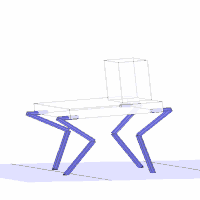
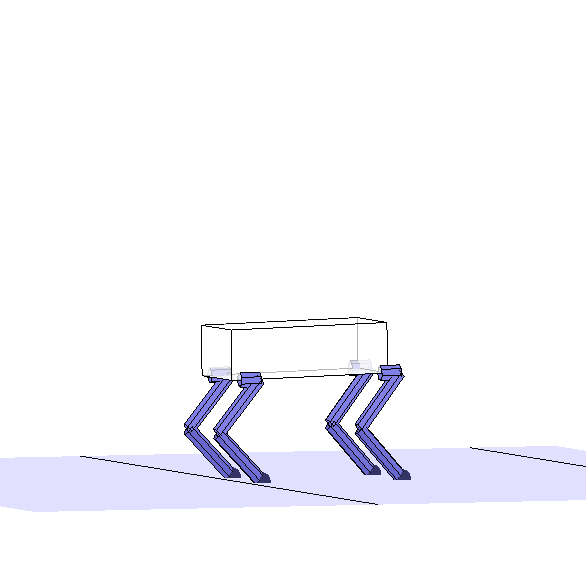

# _Vitruvio_

## Description

_Vitruvio_ is a framework for rapid leg design analysis optimization for legged robots. The purpose of the simulation framework is to guide the early stages of legged robot design. The end effectors track an input trajectory and the necessary joint speed, torque, power and energy for the tracking is computed. These values are subject to a set of customizable user design selections in the form of toggle switches. Optionally, a set of low level design parameters are then optimized using a genetic algorithm optimizer to reduce a user-specified cost funtion.

The framework relies on first importing trajectory data consisting of a center of mass position and orientation as well as end effector positions and forces over time. The input trajectories have been generated using the _TOWR_ trajectory optimizer: https://github.com/ethz-adrl/towr 

_TOWR_ allows for quick computation of feasible trajectories for different tasks using a small set of robot design parameters and as such is well suited to aiding in simulation in the early design stages. 

## Features

:white_check_mark: Computation of joint speed, torque, power and energy required to track an input trajectory.

:white_check_mark: Highly versatile to different user design choices and robot properties allowing for quick comparison of high level design decisions.

   * Direct actuation with actuator placement in the joints or remote actuation with actuators placed in the body.
   * Leg quantity ranging from one to four legs.
   * X or M leg layout.
   * Link quantity ranging from two to four links.
   * Link lengths and density.
   * Actuator selection from a list of existing actuators including ANYdrive and Neo.
   * The input trajectory can be tracked in its entirety, only for a sample of the entire motion, or averaged into a single representative step cycle.

:white_check_mark: Motion visualization.

:white_check_mark: Meta parameter computation including:

   * Cost of transport.
   * Range of joint angles required for motion tracking.
   * Peak joint speed, torque, and power.
   * Energy consumption.

:white_check_mark: Design parameter optimization.

   * Link lengths 
   * Transmission ratios
   * Spring constants for parallel elasticities
   
:white_check_mark: Result plotting.

:white_check_mark: Robot visualization.

:white_check_mark: Facilitated addition of new robot classes and motion tasks.

## Installation

Clone the _Vitruvio_ repository and open it in Matlab. Right click on the _vitruvio_ folder and add the folder and subfolders to path. The following Matlab Toolboxes are required:

   * Robotic System Toolbox
   * Global Optimization Toolbox
   * Parallel Computing Toolbox
   
These can be added using the Add-Ons button in the Matlab Home tab.

## Usage
 
The user should control the simulation using the toggles in the __main.m__ script. New robots and actuators can be added in __getRobotProperties.m__ and __getActuatorProperties.m__. To import a new ROSbag, use the __importMotionData.m__ script.

The intended work flow is as follows:
   
   1. High level robot design decisions are made including quantity of legs, robot mass, center of mass height and end effector positions in nominal stance.
   2. Based on these decisions, the inertia tensor for the robot at its center of mass are computed. This is readily done using the included CAD template for _Siemens NX_.
   3. These design parameters and inertia tensors are input into a new robot model in Towr and the motion is simulated for a given task by specifying gait, goal position, duration and terrain.
   4. The simulated data is imported into _Vitruvio_.
   5. The user makes high level design decisions in _Vitruvio_ and runs the simulation to obtain the required joint speed, torque, power, energy for tracking the motion. If applicable, the optimized leg design parameters are also returned along with comparison of the results for the nominal and optimized leg. These are all recorded in a structure named __results__.
   6. The user can adapt high level design aspects and the cost function terms as desired.
   7. A PDF file is automatically generated containing all the figures created during the simulation. This should be renamed and saved along with the output of the command window to fully record all of the results and selections. 

## Example

To familiarize yourself with _Vitruvio_, open the __testExample.m__ script in the Vitruvio folder and review the different options which can be toggled on/off. These include high level design decisions, visualization options and selection of robots to be optimized. 
The toggles have been set to simulate the universal robot class performing a trot motion using the nominal robot properties read in from the __getRobotProperties.m__ script. 

Run __testExample.m__ and observe the result. The motion is visualized and several plots are generated to show the trajectory and joint data. The values are saved in a structure named after the robot class and task; in this case _universal.trot_. This structure contains all the relevant input and output data of the simulation.

### Optimization 

Now try running the optimization by setting _runOptimization = true_. This will run the genetic algorithm optimization for the link lengths within the specified upper and lower bounds. The default population size and number of generations are both 10 but can be increased to improve the result of the optimization. While the optimization runs, the penalty value of the current best design is shown in the command window. This has been normalized such that values < 1 are an improvement on the nominal design while values > 1 generally indicate worse performance than the nominal design. If the penalty is > 1 this can also indicate that a soft constraint has been violated. Soft constraints violations include joint positions below ground and actuator torque, speed and power limits. Theses are found in __computePenalty.m__.

The cost function is a sum of penalty terms which can be included in the cost function by setting the respective _optimizationProperties.penaltyWeight.penaltyTerm_ to non-zero or removed from the cost function by setting the terms to zero. The penalty also includes soft constraint terms which help ensure feasibility. Some soft constraints such as limiting leg extension and imposing the actuator limits are also activated/deactivated in __main.m__ by setting them to true/false. Others which ensure physical feasibility are always enforced and are found in the __computePenalty.m__ script.

Play around with the different toggle options to understand the different degrees of freedom available to the user.

Once you're finished experimenting in __testExample.m__ open up the __main.m__ script where you can get started running your own simulations.

### Adding your own robot 

To add your own robot and task, first the trajectory data must be input into _Vitruvio_. If using _TOWR_ to generate trajectories, the first step is to run the __importMotionData.m__ script which reads in the trajectory data from a ROSbag and saves it into a .mat file.

After importing the motion data, you will need to add your robot and task to the following scripts in _vitruvio_.

   1. main
   2. simulateSelectedTasks
   3. getRobotProperties
   4. optionally getSuggestedRemovalRatios 
   
Each of these scripts has a section at the top with a template to follow in adding your own robot and task. Similarly if you would like to add a new actuator, this can be done in __getActuatorProperties.m__ 

## License