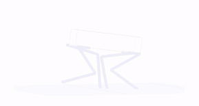
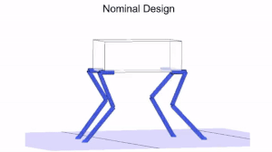

# _Vitruvio_

## Description

_Vitruvio_ is a framework for rapid leg design analysis and optimization for legged robots. The purpose of the simulation framework is to guide the early stages of legged robot design. The end effectors track an input trajectory and the necessary joint speed, torque, power and energy for the tracking is computed. These values are subject to a set of customizable user design selections in the form of toggle switches. Optionally, a set of low level design parameters are then optimized using a genetic algorithm optimizer to reduce a user-specified cost funtion.

The framework relies on first importing trajectory data consisting of a center of mass position and orientation as well as end effector positions and forces over time. The input trajectories have been generated using the [_TOWR_ trajectory optimizer](https://github.com/ethz-adrl/towr) 

_TOWR_ allows for quick computation of feasible trajectories for different tasks using a small set of robot design parameters and as such is well suited to aiding in simulation in the early design stages. 

## Features

:white_check_mark: Computation of joint speed, torque, power and energy required to track an input trajectory.

:white_check_mark: Highly versatile to different user design choices and robot properties allowing for quick comparison of high level design decisions.

   * Direct actuation with actuator placement in the joints or remote actuation with actuators placed in the body.
   * Leg quantity ranging from one to four legs.
   * X or M leg layout.
   * Link quantity ranging from two to four links.
   * Link lengths and density.
   * Actuator selection from a list of existing actuators including ANYdrive and Neo.
   * The input trajectory can be tracked in its entirety, only for a sample of the entire motion, or averaged into a single representative step cycle.

:white_check_mark: Motion visualization.

:white_check_mark: Meta parameter computation including:

   * Cost of transport.
   * Range of joint angles required for motion tracking.
   * Peak joint speed, torque, and power.
   * Energy consumption.

:white_check_mark: Design parameter optimization.

   * Link lengths 
   * Transmission ratios
   * Spring constants for parallel elasticities
   
:white_check_mark: Result plotting.

:white_check_mark: Robot visualization.

:white_check_mark: Facilitated addition of new robot classes and motion tasks.

## Installation

Clone the _Vitruvio_ repository and open it in Matlab. Right click on the _vitruvio_ folder and add the folder and subfolders to path. The following Matlab Toolboxes are required:

   * Robotic System Toolbox
   * Global Optimization Toolbox
   * Parallel Computing Toolbox
   
These can be added using the Add-Ons button in the Matlab Home tab.

## Usage
 
The user should control the simulation using the toggles in `main.m`.
The intended work flow is as follows:
   
   1. High level robot design decisions are made including quantity of legs, robot mass, center of mass height and end effector positions in nominal stance.
   2. Based on these decisions, the inertia tensor for the nominal stance robot at its COM are computed from a simplified CAD model.
   3. These design parameters and inertia tensors are input into a new robot model in _TOWR_ and the motion is simulated for a given task by specifying gait, goal position, duration and terrain.
   4. The simulated ROSbag is imported into _Vitruvio_ using the provided `importMotionData.m` script and saved as a .mat file.
   5. The user makes high level design decisions in _Vitruvio_ and runs the simulation to obtain the required joint speed, torque, power, energy for tracking the motion. If applicable, the optimized leg design parameters are also returned along with comparison of the results for the nominal and optimized leg. These are all recorded in a structure named __results__.
   6. The user can adapt high level design aspects and the cost function terms as desired in the `main.m` script.
   7. If toggled on in `main.m`, a PDF file and txt file are automatically generated containing all the figures and command window printouts created during the simulation. 

## Example

To run _Vitruvio_, open `main.m` and review the different options which can be toggled on/off. These include high level design decisions, visualization options and selection of robots to be optimized. 
The toggles have been set to simulate the ANYmal robot class performing a trotting motion using the nominal robot properties read in from the `scripts/robot and actuator properties/getRobotProperties.m` script. 

Run `main.m` and observe the result. The motion is visualized and several plots are generated to show the trajectory and joint data. The values are saved in a structure named _results_. This structure contains all the relevant input and output data of the simulation.

## Optimization 

Now try running the optimization by setting _runOptimization = true_ in `main.m`. This will run the genetic algorithm optimization for the link lengths within the specified upper and lower bounds. The default population size and number of generations are both 10 but can be increased to improve the result of the optimization. While the optimization runs, the penalty value of the current best design is shown in the command window. This has been normalized such that values < 1 are an improvement on the nominal design while values > 1 generally indicate worse performance than the nominal design when no soft constraints are violated. If the penalty is > 1 this can also indicate that a soft constraint has been violated. 
The cost function is a sum of cost terms which can be included by setting their weights in _optimizationProperties.penaltyWeight_ to non-zero or removed from the cost function by setting the terms to zero. Some soft constraints such as limiting leg extension and imposing the actuator limits are also activated/deactivated in `main.m` by setting them to true/false. Others which ensure physical feasibility (joint positions below ground and violation of actuator torque, speed and power limits) are always enforced and are found in the `scripts/optimization/computePenalty.m` script.

Play around with the different toggle options to understand the different degrees of freedom available to the user.

## Adding your own robot 

To add your own robot, you will need to modify the following scripts:
   1. main
   2. getRobotProperties
   3. getRemovalRatios (optional to crop the motion data)
   
First the trajectory data must be input into _Vitruvio_. Drop the ROSbag generated in _TOWR_ into the _vitruvio_ folder and run the `scripts/trajectory extraction/importMotionData.m` script (first specify robot mass and leg quantity in this script) which reads in the trajectory data and saves it into a .mat file. This .mat file should follow the naming convention of _robotclass_task.mat_. In `main.m` you will need to add the name of the data file dataSelection.robotclass_task to toggle on/off the analysis of this data. 

New robots are added in `scripts/robot and actuator properties/getRobotProperties.m`. Here you must specify geometric properties such as the positions of the HAA joints relative to the COM, the nominal link lengths, densities, end-effector mass. New actuators can be added in `scripts/robot and actuator properties/getActuatorProperties.m` by specifying the actuator mass and limits.

## Limitations
Currently _Vitruvio_ only fully considers pitch of the base and neglects roll and yaw. Motions that involve turning are not properly tracked. Note that for fast motions with heavy legs, the sigle rigid body dynamics model used in the trajectory optimization begin to break down and the results will lose accuracy.

## License
Copyright 2020 Michael Chadwick

Redistribution and use in source and binary forms, with or without modification, are permitted provided that the following conditions are met:

1. Redistributions of source code must retain the above copyright notice, this list of conditions and the following disclaimer.

2. Redistributions in binary form must reproduce the above copyright notice, this list of conditions and the following disclaimer in the documentation and/or other materials provided with the distribution.

3. Neither the name of the copyright holder nor the names of its contributors may be used to endorse or promote products derived from this software without specific prior written permission.

THIS SOFTWARE IS PROVIDED BY THE COPYRIGHT HOLDERS AND CONTRIBUTORS "AS IS" AND ANY EXPRESS OR IMPLIED WARRANTIES, INCLUDING, BUT NOT LIMITED TO, THE IMPLIED WARRANTIES OF MERCHANTABILITY AND FITNESS FOR A PARTICULAR PURPOSE ARE DISCLAIMED. IN NO EVENT SHALL THE COPYRIGHT HOLDER OR CONTRIBUTORS BE LIABLE FOR ANY DIRECT, INDIRECT, INCIDENTAL, SPECIAL, EXEMPLARY, OR CONSEQUENTIAL DAMAGES (INCLUDING, BUT NOT LIMITED TO, PROCUREMENT OF SUBSTITUTE GOODS OR SERVICES; LOSS OF USE, DATA, OR PROFITS; OR BUSINESS INTERRUPTION) HOWEVER CAUSED AND ON ANY THEORY OF LIABILITY, WHETHER IN CONTRACT, STRICT LIABILITY, OR TORT (INCLUDING NEGLIGENCE OR OTHERWISE) ARISING IN ANY WAY OUT OF THE USE OF THIS SOFTWARE, EVEN IF ADVISED OF THE POSSIBILITY OF SUCH DAMAGE.
